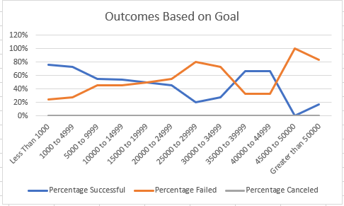
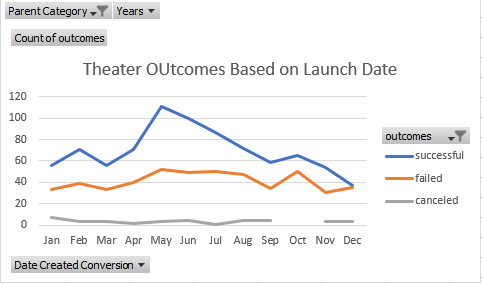

# Kickstarter-Analysis
Performing analysis on Kickstarter data to uncover trends

## **Analysis**

### **Overview of Project**
The purpose of the analysis is to provide data to Louise to help her decide when is the best time to launch theater plays and what is the ideal goal to budget. This is done by providing trends of outcomes based on launch dates and on goals.

### **Analysis and Challenges**

Generally, the higher the amount, the lower is the percentage of success. Conversely, the percentage that a play fails goes higher at each increase in amount. However, this relationship is reverse in between budget of $30,000 to $45,000. It could be noted that there is little to no chance of a play being canceled. Based on the past trends, Louise has a higher percentage of success if she set a goal of less than $5,000. 

Based on the trend, the best period for Louise to launch theater plays is from May to July. This is the peak season for theather shows. On the other hand, the slack period for pays is from September to December.
